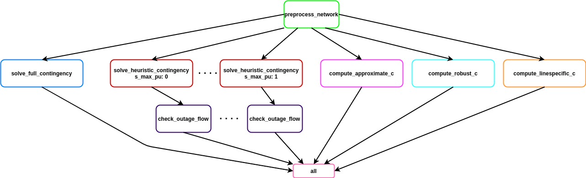

# Workflow Overview


# Find buffer capacity factors

In this repository, we find buffer capacity factor based on our proposed approximate approach `c_a` (cf. rule `compute_approximate_c`),
robust approach for each subset `c_r` (cf. rule `compute_robust_c`) for each subset and whole of the network,
and line-specific approach `c_l` (cf. rule `compute_linespecific_c`) for the all transmission lines.

# Heuristic Security-Constrained LOPF

This repository is useful to test the operational costs of
a network with different buffer capacity (contingency) factors (cf. rule `solve_heuristic_contingency`) versus the
fully security-constrained case (cf. rule `solve_full_contingency`), as well as how
secure the heuristic systems for specific outages (cf. rule `check_outage_flow`).

## Workflow Structure



Documentation inside `scripts/*.py`.

## Configuration Options

The configuration is set in `config.yaml`.

- `network:` specifies the path to the already solved PyPSA-Eur network. Ideal would be a 50-node German network with investments optimized for 90% CO2 redunction, which has lots of flow, but also some conventional generators to set high marginal prices.
- `load_shedding:` adds load shedding generators to the network if not already existing to guarantee feasibility.
- `rolling_horizon:` runs full security-constraint LOPF in batches of snapshots rather than all at once.
- `group_size:` specifies the number of snapshots that form a batch.
- `s_max_pu:` specifies which heuristic contingency factors you want to sweep through.
- `solver:` includes the solver options and parameters.
 
## Executing on Cluster

Mount the LSDF, do `kubectl-login`, go to project directory and execute:

```
kubedo --inception -i pypsa-eur-gurobi -- snakemake -j 99 all
```

## Caveats

Make sure you do not have any lines with `num_parallel=0` and infinite reactance `x=np.inf`.

Make sure you do not have sub networks with a single bus.

## Analysis

You can get the operational costs of a network with different buffer capacity factor with `notebooks/operation_cost.py`.


You can check out the line loadings at the different outages with

```py
import pandas as pd

pd.read_csv("results/new/outage_line_loading_heur....csv", index_col=[0,1,2], parse_dates=True)
```

This file has multiple index levels: the first is the snapshot, the second the component type, the third the line index. The columns denote the outage of the line. The column `base` shows the flows under no outage conditions. You can compare this data to the line capacities in `n.lines.s_nom` to find any overloadings.

You can find total cases and snapshots where the transmission network is overloaded in at least one line for different buffer capacity factors with `notebooks/check_outages.py`.


## Plot

All results has been plotted with `notebooks/plot.ipynb`.